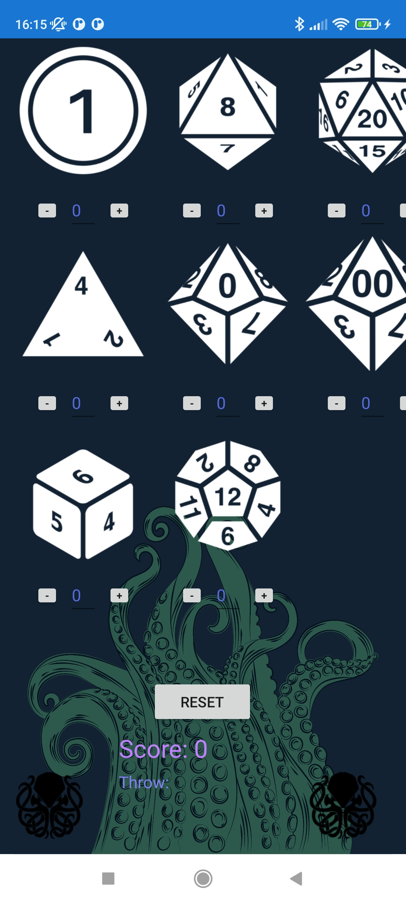
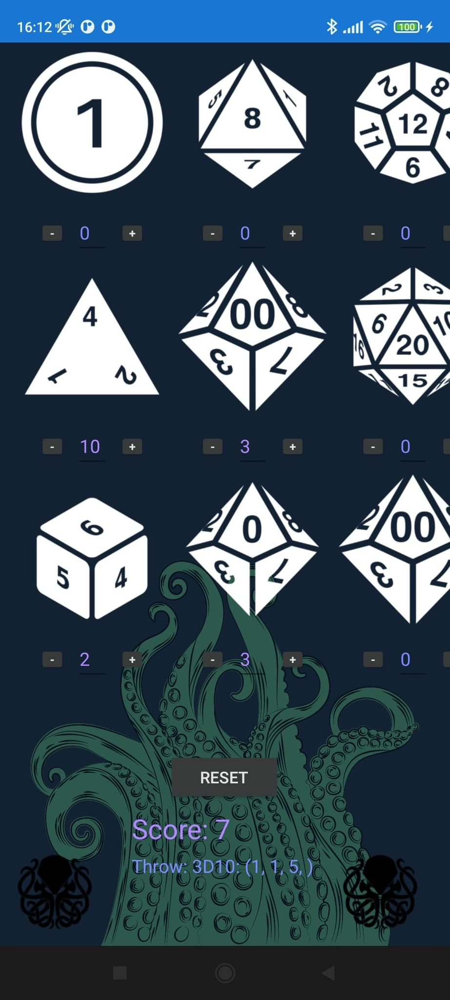
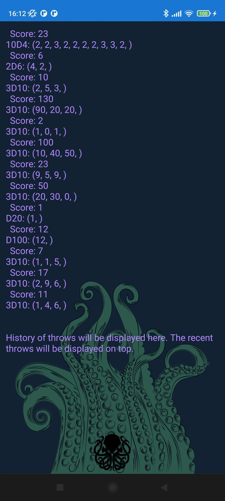

  

<h3 align="center">DiceRoll</h3>

Dices for RPGs

  
Contents

  <ol>
    <li><a href="#About-project">About project</a></li>
    <ul>
      <li><a href="#Features">Features</a></li>
      <li><a href="#Used-technology">Used technology</a></li>
      <li><a href="#Requirements">Requirements</a></li>
    </ul>
    <li><a href="#Installation">Installation</a></li>
    <li><a href="#License">License</a></li>
  </ol>

## About project

  
  
  

**DiceRoll** is an Android mobile app for virtual dices.

### Features:
- [x] Virtual dices: 2d, 4d, 8d, 10d, 12d, 20d, 100d
- [x] Automatic score calculation
- [x] Combine multiple dices to roll at once
- [x] Score history

### Used technology:

  

Xamarin, C#, .NET, VisualStudio

### Requirements:
<ul>
  <li>recommended: Android 11 - R (SDK 30)</li>
  <li>min: Android 5 - Lollipop (SDK 21)</li>
</ul>

## Installation
App is ready to download! 
  
<a href="https://github.com/jakpop11/DiceRoll/releases" target="_blank">
  <b>Download from GitHub</b>
</a>

## License
[INFO](https://github.com/jakpop11/DiceRoll/blob/9b5de77636a79b6f8cf232b391cffd7fd0d15329/DiceRoll/DiceRoll/Assets/About_DiceRoll.txt)
